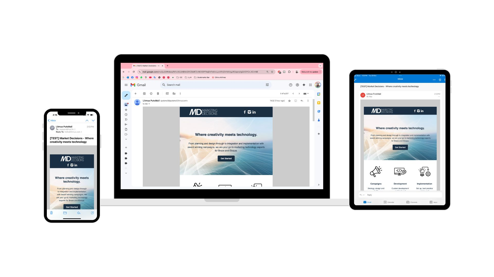

# Marketing Decisions Email Template

This project is a responsive HTML email template created for Marketing Decisions, emphasizing compatibility and consistency across various email clients and devices. The template uses best practices to ensure reliable rendering and accessibility.

## Key Features and Best Practices

- **Responsive, Mobile-First Design**: Built with a mobile-first approach, ensuring optimal display on smaller screens while adjusting for larger ones.
- **Inline CSS**: All styling is applied inline to enhance compatibility across email clients, many of which limit or ignore external and internal stylesheets.
- **Table-Based Layout**: Uses tables to structure the email layout, which is essential for consistent rendering in HTML emails as table-based layouts are widely supported across clients.
- **Web-Hosted Images**: All images are hosted on the web, with URLs embedded directly in the HTML. This approach minimizes email size and ensures images load properly across clients.
- **Fallback Content**: Incorporates background colors and fallback content for sections that may not render images by default, maintaining readability even if images are blocked.

## Cross-Platform Preview

Please see mockup and screenshots below for a visual overview of the template across different platforms.

### Mobile Preview

### Tablet Preview

### Laptop preview

